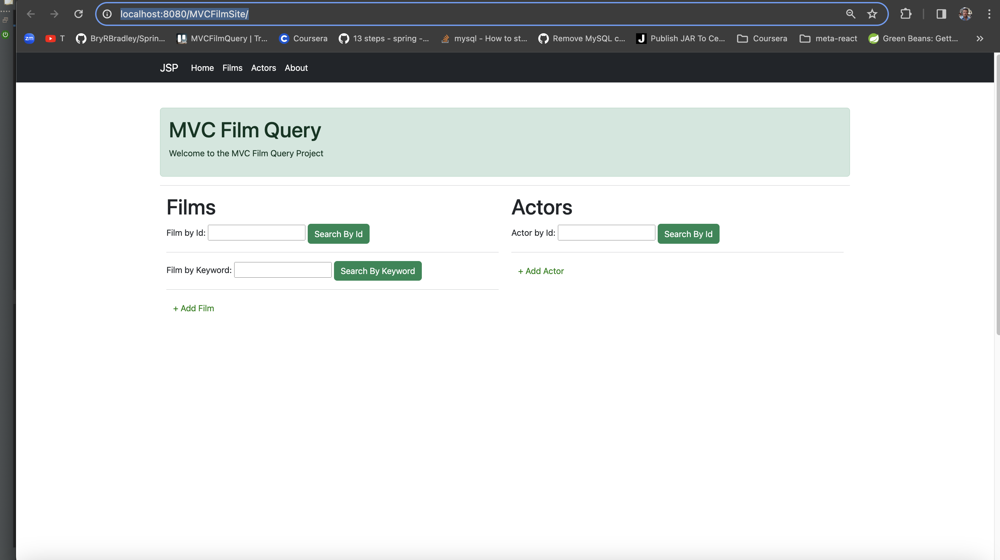
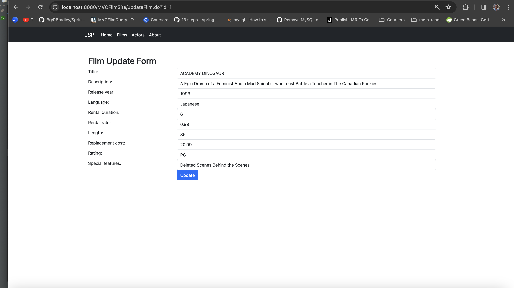
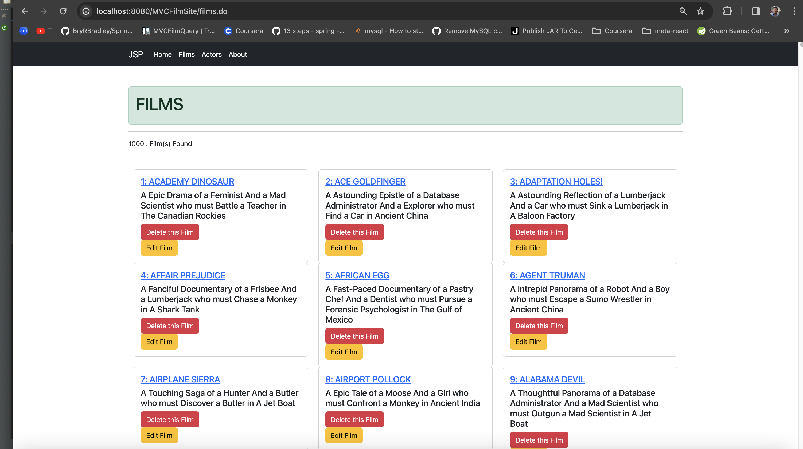
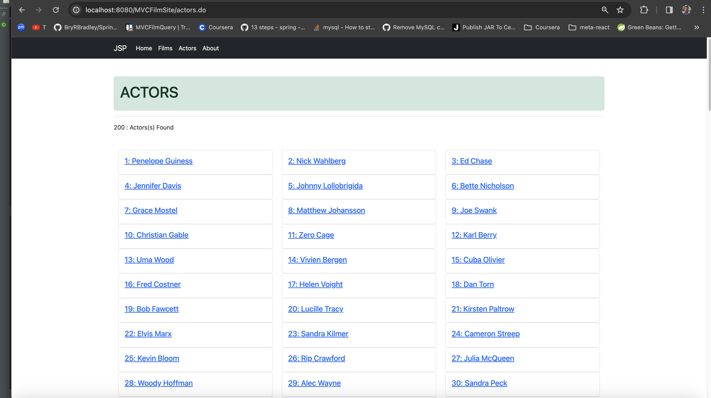

# SpringMVCFilmCRUD

## Description

This application was built to facilitace UI with the SDVID MySQL database. It utilizes Gradle build to interact with the base code and push it to a Tomcat local web server. The application allows a user to:

- Search Films by Id
- Search Films by Keyword
- Search Actors by Id 
- Add an Actor
- Add a Film 
- Edit and exitsing film 
- Delete and actor
- Delete a Film
- 

Special attention was paid to formating user input in order to catch and eliminate errors. There is a robust Error catch structure with an error page feature that displays a user message and the actual error message as well. 

## Technology Used

 - Eclipse IDE  
 - Gradle
 - Bootstrap
 - MAMP  
 - Github
 - Mysql
 - Sublime 
 - MacOS terminal 
 - Java . Microsoft Word 
 - UML
 - Zoom, Slack, Trello 
 - Tomcat Server
 - Chrome browser
 - Languages: Java, CSS, HTML, MYSQL, Groovy 

## Project Goals 

1. We wanted to especially focus on the data types for UI and ensure that each value was self explanatory and would direct users accordingly. 
2. Enable team members extensive experience at stress testing for UI/UX issues and solving those problems.
3. Exceed all program requirments while maintaing "dry" readable code.

## Lessons Learned

One of tha largest lesson we learned was trouble shooting STS and Gradle interface when collaberating through GitHub. We both ran into issues where server's functionality wasn't working after a Git Pull. In addition the methods where we were intially catching errors was refactored to make the code more readable. We found that many times more verbose error messages were key to readability and provide room for future development. 

## Coding Time and Testing
- 05 APR - Initial stubbs built out. Created assignments of project resonsibilty, timelines and goals. V1 pushed to GitHub.
- 06 Apr - V3/V4 coded 1000 - 1730  Adressed Stories 1-4 and refactored error catches and user input values.
- 07 Apr - V5 coded 1000-1330 - Final version of the application addressing Story 5, added the README and did a little refactoring. 

### Screenshots 

### Links 

https://github.com/BryRBradley/SpringMVCFilmCRUD

[About The Developers - Sheldon](https://www.linkedin.com/in/sheldonpasciak)

[About The Developers - Bryan](https://www.linkedin.com/in/sheldonpasciak)

